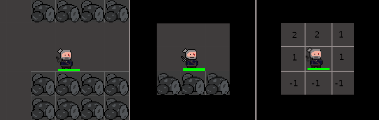
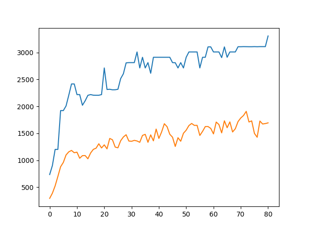
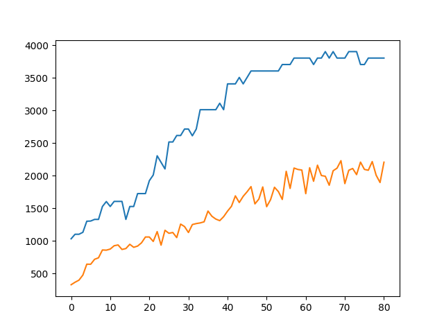
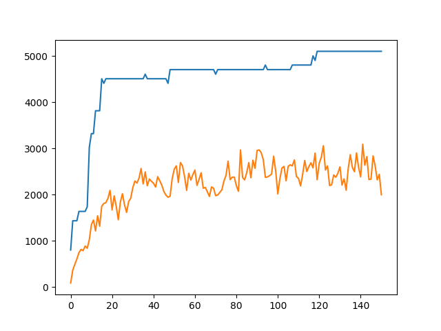
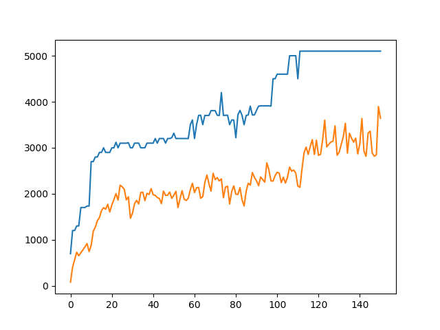

# SZI - podprojekt

W mojej części projektu postanowiłem wszczepić naszemu agentowi (Geraltowi) mózg w postaci sieci neuronowej, która będzie wytrenowana tak by agent samodzielnie poruszał się w zadanym środowisku i pokonywał wszelkie przeciwności losu w jak najbardziej racjonalny sposób. Do trenowania siedzi postanowiłem wypróbować algorytm genetyczny.

---

## Część 1 - pierwsze kroki

Pierwszym małym krokiem do pełnego usamodzielnienia agenta była próba rozwiązania prostszego problemu, tj. tak wytrenować sieć by agent nie wpadał na przeszkody i odwiedził jak najwięcej pól na mapie w zadanym czasie.

---

### Środowisko

*   Agent porusza się po planszy która może mieć różne wymiary.
*   Na planszy znajdują się pola na które można wejść (trawa), oraz takie na które nie można wejść (kamień, woda)
*   Na początku gry każde pole jest nieodwiedzone, gdy w pewnym momencie agent wejdzie na dane pole będzie ono uznane za odwiedzone
*   Agent nie posiada informacji o całej mapie, zna tylko swoje otoczenie
*   W każdej rundzie agent musi poruszyć się w dół, lewo, górę, lub prawo.
*   Za odwiedzenie nowego pola agent dostaje 100 punktów, za odwiedzenie pola już odwiedzonego 1 punkt
*   Jeśli agent spróbuje wejść w przeszkodę gra się kończy



Na rysunku przykład gdzie agent dostaje informacje tylko o najbliższych polach.

#### Informacje o kafelkach

| kod | opis               | kodowanie |
| --- | ------------------ | --------- |
| -1  | przeszkoda         | 100       |
| 1   | nieodwiedzone pole | 010       |
| 2   | odwiedzone pole    | 001       |

---

### Sieć neuronowa

#### wejście

Na wejściu sieć dostanie (n \* 3) sygnałów (0 lub 1), gdzie n to ilość kratek które widzi agent. W najprostszym przypadku (rysunek powyżej) agent będzie widział 8 kratek dookoła, jeśli jedną kratę możemy zakodować za pomocą trzech bitów, daje nam to łącznie 24 wejścia do sieci.

#### warstwa ukryta

Sieć może (ale nie musi) mieć jedną warstwę ukrytą, która będzie w całości połączona z warstwami wejścia i wyjścia. Ilość neuronów w warstwie ukrytej możemy regulować.

#### wyjście

Na wyjściu znajdują się 4 neurony, które przyjmą wartość z przedziału (0;1), każde wyjście odpowiada jednemu kierunkowi ruchu. Im większa liczba tym lepszym pomysłem jest ruch w daną stronę.

Przykładowe wyjście

```
[GÓRA, DÓŁ, PRAWO, LEWO]

[0.93969657 0.07848462 0.30899373 0.10675868]
```

#### trenowanie sieci

do trenowania sieci został użyty algorytm genetyczny:

1.  Zainicjuj populację losowych sieci
2.  Wykonaj symulacje gry z każdą siecią. Oceną sieci będzie liczba uzyskanych punktków.
3.  Jeśli uzyskano zadowalający wynik lub wygenerowano wystarczająco dużo generacji, zakończ program.
4.  Wygeneruj nową populacje krzyżując stare sieci, im sieć ma wyższą ocenę tym bardziej prawdopodobne że zostanie użyta do reprodukcji
5.  Zmutuj każdą z sieci z pewnym małym prawdopodobieństwem
6.  Idź do kroku 2.

</br>

**krzyżowanie**

By móc się skrzyżować neurony N1 i N2 muszą mieć identyczne architektury, tzn. tyle somo warstw oraz po tyle samo neuronów w odpowiendich warstwach

dla dwóch sieci N1 i N2 zostały zaimplementowane 3 sposoby krzyżowania:

*   neurons

    *   Z pewnym prawdopodobieństwem możemy zamieśić wszystkie wagi dla pewnego neuronu z N1 i N2. Dotyczy to zarówno warstwy ukrytej jak i warstwy wyjścia
    *   uzyskane sieci: 2

*   wieghts

    *   Z pewnym prawdopodobieństwem możemy zamienić wagi pojedynczych połączeń z dowolnego neuronu N1 i N2
    *   uzyskane sieci: 2

*   wieghts
    *   Nowa sieć N3 będzie miała wagi połączeń równe średniej arytmetycznej korespondujących wag z N1 i N2
    *   uzyskane sieci: 1

**mutacja**

Dla każdej wagi w dowolnym neuronie istnieje prawdopodobieństwo zastąpienia tej wagi nową wagą lub zamiany jej znaku na przeciwny

**nagroda**

Wynik najlepszej sieci z danej generacji jest mnożony przez pewną stałą.

---

\newpage
\pagebreak

# Wyniki

Wykresy przedstawiają jak zmieniała się punktacja sieci w następnych generacjach

---

| cecha                          | wartość   |
| ------------------------------ | --------- |
| zadanie                        | 40 ruchów |
| wejść                          | 24        |
| funkcja                        | sigmoid   |
| neurony w ukrytej warstwie     | 0         |
| liczebność populacji           | 50        |
| maksymlana liczba tur          | 80        |
| typ krzyżowania                | 'means'   |
| prawdopodobieństwo mutacji     | 1%        |
| prawdopodobieństwo krzyżowania | 30%       |
| maksymlana liczba punktów      | 4100      |



\pagebreak

| cecha                          | wartość   |
| ------------------------------ | --------- |
| zadanie                        | 40 ruchów |
| wejść                          | 24        |
| funkcja                        | sigmoid   |
| neurony w ukrytej warstwie     | **60**    |
| liczebność populacji           | 50        |
| maksymlana liczba tur          | 80        |
| typ krzyżowania                | 'means'   |
| prawdopodobieństwo mutacji     | 1%        |
| prawdopodobieństwo krzyżowania | 30%       |
| maksymlana liczba punktów      | 4100      |



\pagebreak

| cecha                          | wartość   |
| ------------------------------ | --------- |
| zadanie                        | 50 ruchów |
| wejść                          | 24        |
| funkcja                        | sigmoid   |
| neurony w ukrytej warstwie     | **50**    |
| liczebność populacji           | 60        |
| maksymlana liczba tur          | 150       |
| typ krzyżowania                | 'weights' |
| prawdopodobieństwo mutacji     | 1%        |
| prawdopodobieństwo krzyżowania | 30%       |
| maksymlana liczba punktów      | 5100      |



\pagebreak

| cecha                          | wartość   |
| ------------------------------ | --------- |
| zadanie                        | 50 ruchów |
| wejść                          | 24        |
| funkcja                        | sigmoid   |
| neurony w ukrytej warstwie     | **50**    |
| liczebność populacji           | 60        |
| maksymlana liczba tur          | 150       |
| typ krzyżowania                | 'means'   |
| prawdopodobieństwo mutacji     | 1%        |
| prawdopodobieństwo krzyżowania | 30%       |
| maksymlana liczba punktów      | 5100      |


